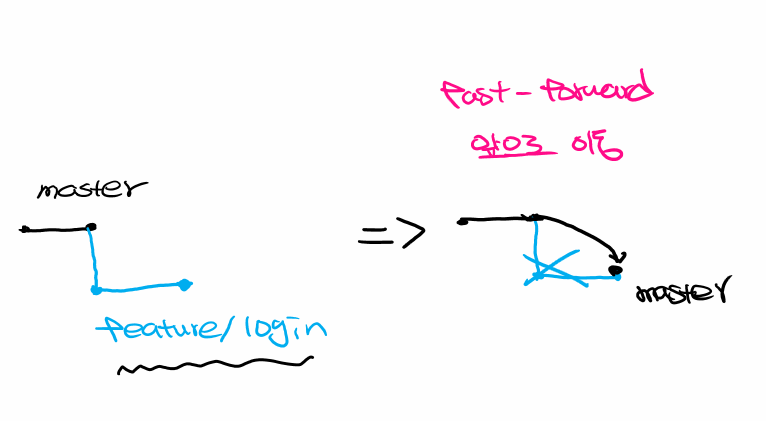
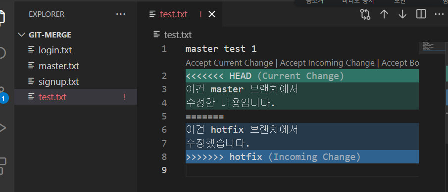

# branch scenario

## 1. branch 사용법

> 브랜치를 조작할 떄는 반드시 `master` 브랜치의 최소 1개의 commit은 있어야 함.


**실습 준비**

```bash
# git 초기화 및 commit 남겨놓기

$ git init
$ touch a.txt
# a.txt text 1이라는 글을 작성한다.

$ git add .
$ git commit -m "text 1"
[master (root-commit) 76526b0] text 1
 1 file changed, 1 insertion(+)
 create mode 100644 a.txt
```

```bash
# 3개의 커밋을 더 남긴다.
$ git log --oneline
e7e679d (HEAD -> master) text 3
34eb48c text 2
76526b0 text 1
```


`HEAD`

https://stackoverflow.com/questions/2304087/what-is-head-in-git

- HEAD가 가리키는 것은 **현재 위치한 브랜치의 최신 커밋**
- HEAD는 현재 브랜치를 가리키는 포인터


ex) 이제 우리는 로그인 기능을 개발합니다.

```bash
$ git branch feature/login
$ git branch
  feature/login
* master
```


master 브랜치에서 마지막 줄 추가

```bash
text 1
text 2
text 3
master에서 작성한 text 4 # 추가

# add, commit
$ git add .
$ git commit -m "master text 4"
[master bde4505] master text 4
 1 file changed, 2 insertions(+), 1 deletion(-)
 
 # log
$ git log --oneline
a843f4f (HEAD -> master) master text 4
05d8037 (feature/login) text 3
d8d4cef text 2
1cacf28 text 1
```


브랜치 이동을 하고 `a.txt`를 확인해보자

```bash
$ git checkout feature/login 
Switched to branch 'feature/login'

# master text 4가 사라짐

# log 확인
$ git log --oneline
05d8037 (HEAD -> feature/login) text 3
d8d4cef text 2
1cacf28 text 1
```


```bash
# 현재 브랜치는 feature/login

text 1
text 2
text 3
login text4 # 추가
```


**브랜치를 다룰 때는 현재 내가 '어떤' 브랜치에 있는지를 반드시 알아야 함!!!**

```bash
# login.txt

login text 4 # 추가
```


```bash
$ git status
On branch feature/login
Changes not staged for commit:
  (use "git add <file>..." to update what will be committed)
  (use "git restore <file>..." to discard changes in 
working directory)
        modified:   a.txt # wd + commit 이력 있음(modified)

Untracked files:
  (use "git add <file>..." to include in what will be committed)
        login.txt # WD + commit 이력 없음(git이 지금까지 한번도 추적한 적 없음)

no changes added to commit (use "git add" and/or "git commit -a")

# add, commit
$ git add .
$ git commit -m "login text4"
[feature/login 5a98d3e] login text4
 2 files changed, 3 insertions(+), 1 deletion(-)
 create mode 100644 login.txt
 
# 현재 브랜치는? feature/login
$ git log --oneline
5a98d3e (HEAD -> feature/login) login text4
e7e679d text 3
34eb48c text 2
76526b0 text 1

# 다른 브랜치의 그래프까지 보는 방법
$ git log --all --graph --oneline
* 5a98d3e (HEAD -> feature/login) login text4        
| * bde4505 (master) master text 4
|/
* e7e679d text 3
* 34eb48c text 2
* 76526b0 text 1
```


## 2. branch merge scenario

```bash
# 바탕 화면에 git-merge 폴더 생성 후 해당 폴더에서 vs code를 열자!

$ git init
Initialized empty Git repository in C:/Users/campusseven05/Desktop/git-merge/.git/
$ touch test.txt

# test.txt에 master test 1이라고 채워넣기 (저장 꼭!!)

$ git status
On branch master

No commits yet

Untracked files:
  (use "git add <file>..." to include in what will be committed)
        test.txt

nothing added to commit but untracked files present (use "git add" to track)

$ git add .
$ git commit -m "master test 1"
[master (root-commit) 3cd9906] master test 1
 1 file changed, 1 insertion(+)
 create mode 100644 test.txt
 
# log
$ git log
commit 3cd9906376e433d324e57f92387c8b71727351c7 (HEAD -> master)
Author: edujustin <edujustin.hphk@gmail.com>
Date:   Tue Jul 6 13:27:09 2021 +0900

    master test 1
```


### 3가지 병합 상황

### 1. fast-forward




- 주의 사항 ! 반드시 master 브랜치에는 1개 이상의 커밋이 존재해야 함!!!!!

> "다른 브랜치가 생성된 이후에 master 브랜치의 변경 사항이 없는 상황 => 단순하게 master 브랜치의 포인터를 최신 commit으로 이동 시킨다"

master 브랜치에서 `feature/login` 브랜치를 병합(merge) 할 때 `feature/login` 브랜치가 master 브랜치 이후의 commit을 가리키고 있다면 master 브랜치는 `feature/login` 브랜치가 가리키고 있는 최신 commit으로 포인터(HEAD)를 이동 시키면 된다.


1. feature/login 브랜치 생성 후 이동

   ```bash
   $ git checkout -b feature/login
   Switched to a new branch 'feature/login'
   ```

2. 특정한 작업을 완료하고 commit 진행

   ```bash
   $ touch login.txt
   $ git add .
   $ git commit -m "login test 1"
   [feature/login beb3f87] login test 1
    1 file changed, 0 insertions(+), 0 deletions(-)    
    create mode 100644 login.txt
    
   # log
   $ git log --oneline                                 
   # master 브랜치에서 feature/login 브랜치 생성 -> feature/login 브랜치에서 새로운 commit 생성 
   a6b8c9e (HEAD -> feature/login) login test 1        
   48cabd6 (master) master test 1
   ```

3.  master 브랜치로 이동

   - 브랜치를 이동하는 순간 login.txt 파일이 사라진다.
   - 왜냐하면 login.txt 파일은 master 브랜치가 아니라 feature/login 브랜치에서 commit(버전)을 했기 때문임

   ```bash
   $ git checkout master
   Switched to branch 'master'
   ```


4.  master 브랜치에서 feature/login 브랜치에서 작업한 결과물 병합

   -  병합 이후에 login.txt 파일이 생김

   ```bash
   $ git merge feature/login
   Updating 48cabd6..a6b8c9e
   Fast-forward
    login.txt | 0
    1 file changed, 0 insertions(+), 0 deletions(-)    
    create mode 100644 login.txt
   ```

5. 로그 확인

   - HEAD -> master가 위로 올라왔음!

   ```bash
   # 병합 전
   $ git log --oneline
   # master 브랜치에서 feature/login 브랜치 생성 -> feature/login 브랜치에서 새로운 commit 생성
   a6b8c9e (HEAD -> feature/login) login test 1        
   48cabd6 (master) master test 1
   
   # 병합 후
   $ git log --oneline
   a6b8c9e (HEAD -> master, feature/login) login test 1
   48cabd6 master test 1
   ```

6.  브랜치 삭제

   ```bash
   $ git branch -d feature/login
   Deleted branch feature/login (was a6b8c9e).
   ```

   

### 2. Merge commit -> conflict x

> 다른 브랜치가(feature/signup) 생성된 이후에 **master 브랜치에 변경 사항이 있고 다른 브랜치(feature/signup)**에도 변경 사항이 존재하는 경우 -> 이때 충돌 상황이 발생하지 않는 경우

- 다른 파일의 변경 사항을 commit 한 경우

1. signup 브랜치 생성 & 이동

   ```bash
   $ git checkout -b feature/signup
   Switched to a new branch 'feature/signup'
   ```

2. 특정한 작업을 진행하고 commit

   ```bash
   $ touch signup.txt
   
   # add, commit
   $ git add .
   $ git commit -m "signup test 1"
   [feature/signup d8c62e7] signup test 1
    1 file changed, 0 insertions(+), 0 deletions(-)    
    create mode 100644 signup.txt
    
   # log
   $ git log --oneline
   d8c62e7 (HEAD -> feature/signup) signup test 1 # feature/signup 브랜치의 최신 커밋 + 현재 내가 위치한 브랜치
   beb3f87 (master) login test 1 # master 브랜치의 최신 커밋
   9122541 master test 1
   ```

3. master로 이동

   - 이동하는 순간 signup.txt 파일이 사라짐
   - signup 브랜치에서 파일을 생성하고 commit 했기 때문!

   ```bash
   ```

   

### 3. Merge commit -> conflict o

> 다른 브랜치(feature/signup)가 생성된 이후에 **master 브랜치에 변경 사항이 있고 다른 브랜치(feature/signup)**에도 변경 사항이 존재하는 경우 -> 이때 충돌 상황이 발생하는 경우

- 같은 파일의 같은 부분을 작성(수정)하여 commit 한 경우
- `merge commit`이 발생함
  - 이 commit 내역은 우리가 직접 작성한 commit이 아닌 git이 자동으로 작성해준 commit message


1. hotfix 브랜치 생성 후 이동

   ```bash
   $ git checkout -b hotfix
   Switched to a new branch 'hotfix'
   ```

2. 특정 작업 완료 후 & commit 진행

   ```bash
   master test 1
   이건 hotfix 브랜치에서 # test.txt 파일에 2번째 줄에서 추가
   수정했습니다
   ```

   ```bash
   $ git add .
   $ git commit -m "hotfix test 1"
   [hotfix a094f24] hotfix test 1
    1 file changed, 3 insertions(+), 1 deletion(-)
    
   $ git log --oneline
   a094f24 (HEAD -> hotfix) hotfix test 1
   25392f4 (master) Merge branch 'feature/signup'       
   8f0a66f master test 1
   513dd9f signup test 1
   2fff2ab login test 1
   3cd9906 master test 1
   ```
   
3.  master로 이동

   ```bash
   $ git checkout master
   Switched to branch 'master'
   ```

4. 특정 작업 후 commit

   - hotfix 브랜치에서 작업한 부분과 동일한 부분을 수정

   ```bash
   # master branch의 test.txt 생성 후 입력
   master test 1
   이건 master 브랜치에서 # 추가
   수정한 내용입니다.
   ```

   ```bash
   $ git add .
   $ git commit -m "master test 1"
   [master fb44eef] master test 1
    1 file changed, 3 insertions(+), 1 deletion(-)
    
   # log
   $ git log --oneline
   fb44eef (HEAD -> master) master test 1
   25392f4 Merge branch 'feature/signup'
   8f0a66f master test 1
   513dd9f signup test 1
   2fff2ab login test 1
   3cd9906 master test 1
   ```

5. Merge

   ```bash
   $ git merge hotfix 
   Auto-merging test.txt
   CONFLICT (content): Merge conflict in test.txt # 충돌.. -> merge 하는 과정에서 충돌이 발생함 -> test.txt
   
   # 자동으로 병합하는 것 실패!! -> 충돌을 해결하고 난 다음에 그 결과를 commit 하셈
   Automatic merge failed; fix conflicts and then commit the result.
   
   # 첫 번째 누르면 통합됨
   ```

   

   

   ```bash
   master test 1
   <<<<<<< HEAD
   이건 master 브랜치에서 
   수정한 내용입니다.
   =======
   이건 hotfix 브랜치에서
   수정했습니다.
   >>>>>>> hotfix
   ```

   ```bash
   # 수정
   master test 1
   이건 master 브랜치에서 
   수정한 내용입니다.
   이건 hotfix 브랜치에서
   수정했습니다.
   ```

   ```bash
   campusseven05@DESKTOP-30KI4HL MINGW64 ~/Desktop/git-merge (master|MERGING) 
   # master | MERGING -> Merge commit을 남겨야 함
   
   $ git status
   On branch master
   You have unmerged paths.
     (fix conflicts and run "git commit")        
     (use "git merge --abort" to abort the merge)
   
   Unmerged paths:
     (use "git add <file>..." to mark resolution)
           both modified:   test.txt # both modifed 
   
   no changes added to commit (use "git add" and/or "git commit -a")
   
   # add로 올리고 commit으로 Merge commit을 직접 남긴다.
   $ git add .
   $ git commit -m "충돌 해결!!!"
   git commit -m "충돌 해결git add .!"
   [master 35a5e9b] 충돌 해결git add .!
   ```

6.  log 확인

   - 충돌이 발생하지 않은 경우에는 `25392f4 (HEAD -> master) Merge branch 'feature/signup' ` 이러한 commit을 git이 자동으로 만들어주지만 충돌을 직접 해결하는 경우 우리가 충돌을 해결했다는 의미의 커밋을 직접 남길 수 있다. 

   ```bash
   $ git log --oneline
   35a5e9b (HEAD -> master) 충돌 해결git add .!
   fb44eef master test 1
   a094f24 (hotfix) hotfix test 1
   25392f4 Merge branch 'feature/signup'
   8f0a66f master test 1
   513dd9f signup test 1
   2fff2ab login test 1
   3cd9906 master test 1
   ```

7. branch 삭제

   ```bash
   $ git branch -d hotfix 
   Deleted branch hotfix (was a094f24).
   
   # log
   $ git log --all --oneline --graph
   *   35a5e9b (HEAD -> master) 충돌 해결git add .!
   |\
   | * a094f24 hotfix test 1
   * | fb44eef master test 1
   |/
   *   25392f4 Merge branch 'feature/signup'       
   |\
   | * 513dd9f signup test 1
   * | 8f0a66f master test 1
   |/
   * 2fff2ab login test 1
   * 3cd9906 master test 1
   ```

   

